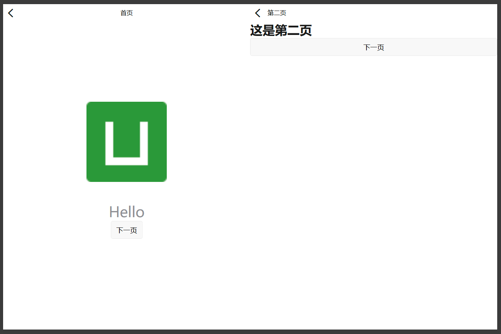
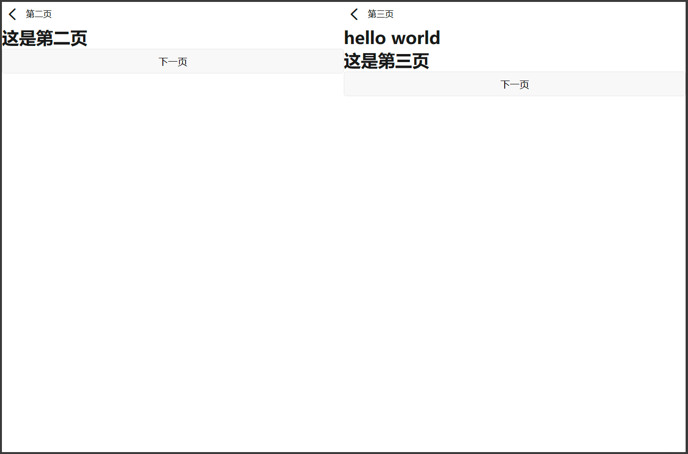
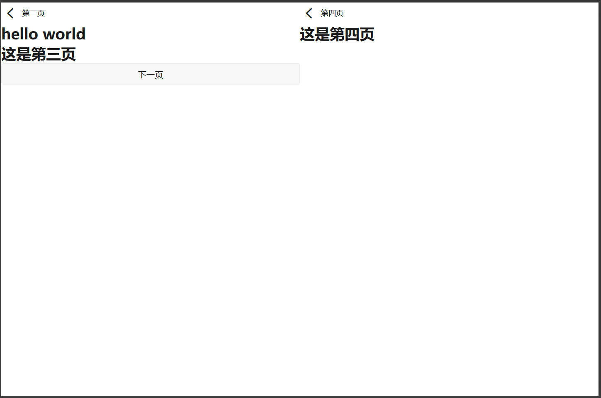

# MulElement
## mul-navigation
> 宽屏需要分屏，左右屏需要展示两个页面的解决方案
#### usage
* main.js
```js
import getDevice from "@/common/getDevice.js";
import MulElement from "../mul-element";
// 传入getDevice，作为mixins，getDevice中维护一个响应式的变量--device，代表当前的设备类型。
// phone: 手机或者折叠屏折叠（“phone”值必须能够取到）
// fold: 折叠屏展开
// pad: 三折叠展开或者平板
Vue.use(MulElement, {getDevice})
```
* App.vue
```vue
<script lang="ts">
import Vue from 'vue';

export default Vue.extend({
  mpType: 'app',
  ...,
  // globalData中需要维护一个statusBarHeight变量，代表状态栏的高度，可通过uni.getSystemInfoSync().statusBarHeight获取
  globalData: {
    statusBarHeight: uni.getSystemInfoSync().statusBarHeight
  },
  ...
});
</script>
```
* 页面文件（.vue)
```vue
<template>
  <!-- 已经全局注册，直接使用，不用再单独引入 -->
  <mul-navigation :other="showSecond" v-model="showDetail" title="首页" title-position="center">
    <template v-slot:home>
      <view class="content">
        <image class="logo" src="../../static/logo.png"></image>
        <text class="title">{{ title }}</text>
        <button @tap="gotoPage">下一页</button>
      </view>
    </template>
    <nav-destination :hide-title="true">
      <!-- mul-navigation通过v-model传入的变量控制右屏的展示。 -->
      <!-- 如果mul-navigation是嵌套另一个mul-navigation使用，需要将外层mul-navigation的v-model变量传入内层mul-navigation的self.sync中 -->
      <!-- 如果mul-navigation是嵌套另一个mul-navigation使用，需要将内层mul-navigation的v-model变量传入外层mul-navigation的other中-->
      <mul-navigation :other="showThird" :self.sync="showDetail" v-model="showSecond" title="第二页">
        <template v-slot:home>
          <h1>这是第二页</h1>
          <button @tap="showSecond=true">下一页</button>
        </template>
        <nav-destination :hide-title="true">
          <mul-navigation v-model="showThird" :self.sync="showSecond" title="第三页">
            <template v-slot:home>
              <h1>hello world</h1>
              <h1>这是第三页</h1>
              <button @tap="showThird=true">下一页</button>
            </template>
            <nav-destination v-model="showThird" title="第四页">
              <h1>这是第四页</h1>
            </nav-destination>
          </mul-navigation>
        </nav-destination>
      </mul-navigation>
    </nav-destination>
  </mul-navigation>
</template>

<script>
export default {
  data() {
    return {
      title: 'Hello',
      showDetail: false,
      showSecond: false,
      showThird: false
    }
  },
  // 如需要自定义系统的返回逻辑，需监听onBackPress生命周期方法
  onBackPress(options) {
    const instance = this.$navigation.slice(-1)[0]
    return instance?.onBack(true)
  },
  methods: {
    gotoPage() {
      this.showDetail = true
    }
  }
};
</script>

<style>
.content {
  display: flex;
  flex-direction: column;
  align-items: center;
  justify-content: center;
}

.logo {
  height: 200rpx;
  width: 200rpx;
  margin: 200rpx auto 50rpx auto;
}

.title {
  font-size: 36rpx;
  color: #8f8f94;
}
</style>
```
#### screenshot


